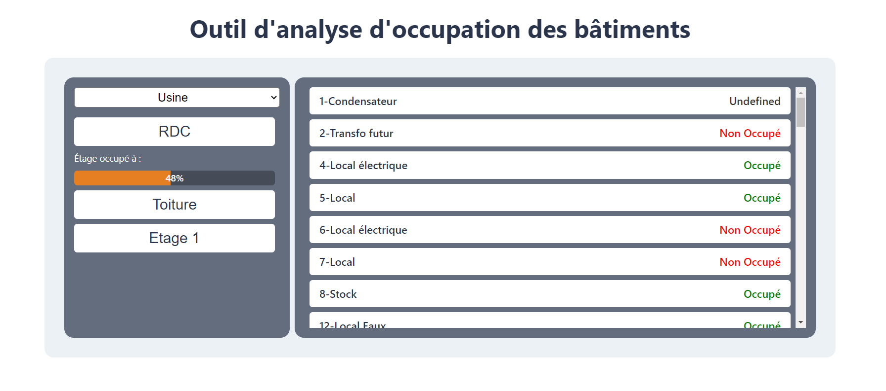

# SPINALCOM Exercice front-end

## Consigne

Développer une application web qui, au travers d’API, affiche l’occupation de chaque pièce, par étage, du bâtiment.
Valeur de l’occupation : TRUE si occupée, FALSE si non-occupée, UNDEFINED si on n’est pas capable de récupérer la valeur.

Le candidat sera principalement évalué sur :
1. Sa capacité à fournir un design correct pour son application. Un exemple très basique et le travail de précédents
étudiants sont fournis en annexe pour laisser place à la créativité de l’étudiant tout en lui donnant quelques
idées.
2. Sa capacité à fournir un front-end fonctionnel.

Documentation Swagger des API de la plateforme du candidat : https://api-developers.spinalcom.com/spinalcom-API-docs/#/

## Installation

To run the project locally, follow these steps:

1. Clone the repository to your local machine.
2. Navigate to the project directory.
3. Run `npm install`.
4. Run `npm start`.
